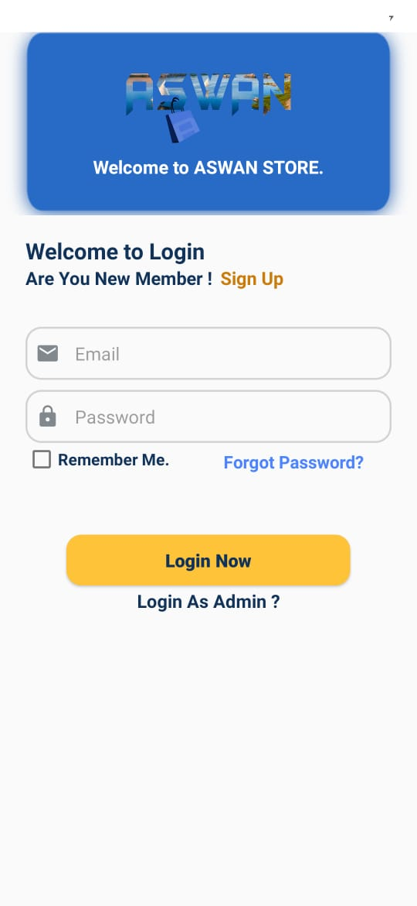
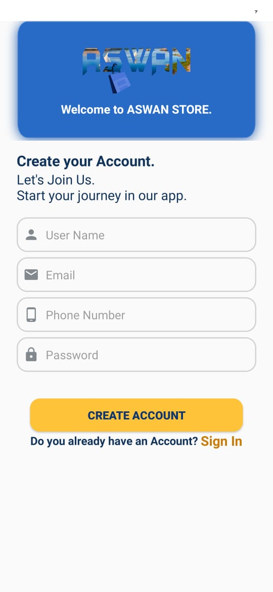
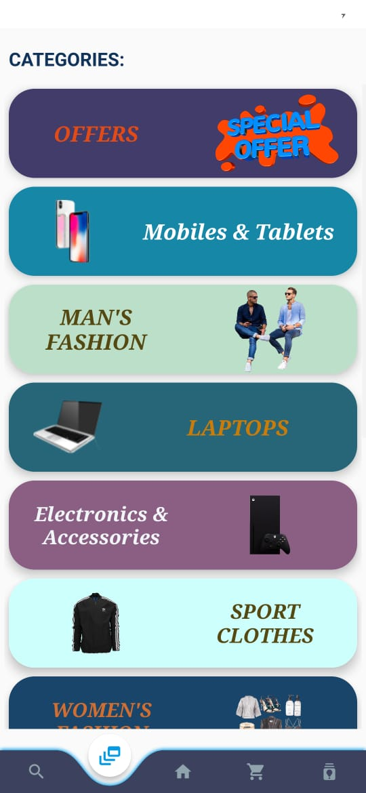
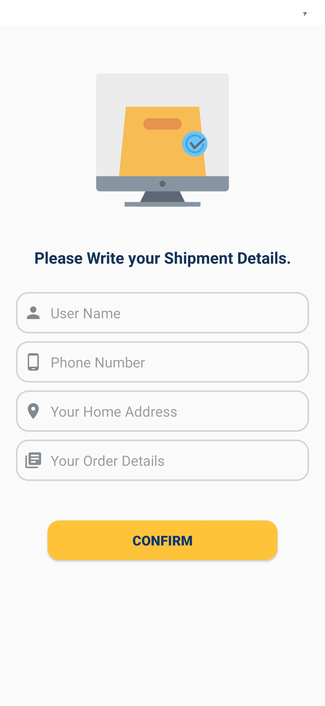

# ASWAN Store
This is the code that powers the Firebase RealTime on Android by Dev Ahmed Ramadan. ahmedtramadan4@gmail.com

## Published On Play Store
https://play.google.com/store/apps/details?id=com.aramadan.aswan

# Highlights of the application features
We help you to make your life easier and save your effort and your time.
You will find here all the products of the shops in the market of the governorates of Aswan and Luxor, clothes, electronics, mobiles and so on.
Our main goal of this application is to facilitate the buying and selling process for you through:
credibility in product specifications by the merchant, realism where the goods in the store are identical to what is on the ground in
the shops contracted with us, the speed of delivery and convenience, so instead of going shopping, you will shop With your mobile phone and the product will be delivered to your home. "Aswan Store" was established in 2021. We wanted to make a difference and we sought to implement the first online store for shopping in all parts of Aswan or Upper Egypt Governorates. Luxuries that carry both luxury and quality.
We offer you distinguished services, as the ease of the payment system, as well as allow you to retrieve the product in the absence of it suitable for you.
We wish you to provide the best service and the best deal, and that you will be happy with our dealings as we were pleased with your honor to us.

Other Features
- Compatible with 99% of mobile phone devices.
- Amazing Navigation bottom
- Searching for Proudcts
- Support different language "Arabic and English"  

# ScreenShot
                            
       
    
